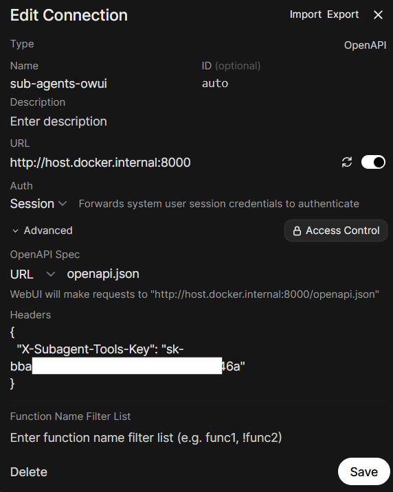
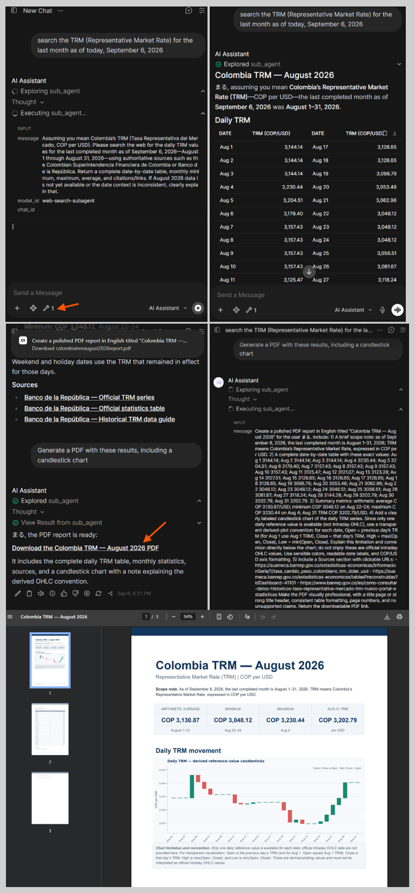

# owui_agents

Lets a parent agent delegate work to sub-agents in Open WebUI through a single HTTP endpoint:
send one task or several, and get back each answer plus the session id to continue the
conversation later. It solves auth passthrough, per-model tool resolution, and session tracking,
so the parent agent doesn't have to handle any of that.

The proxy exposes one tool operation, `sub_agents` (`POST /proxy/chat/batch`). A single task is
just a batch of one.

## Environment variables

See `.env.example`:

| Variable | Description |
|----------|-------------|
| `OPENWEBUI_BASE_URL` | Open WebUI instance the proxy talks to. Inside a container this must NOT be `localhost` — use `http://host.docker.internal:3000` or a service name on a shared Docker network. |
| `PORT` | **Required.** Port the container listens on (e.g. `8000`). The app will not start without it — always set it explicitly: `-e PORT=...`, `.env`, or the cloud platform's env settings. |
| `MAX_BATCH_SUBAGENTS` | Optional, default `5`. Maximum number of sub-agents run concurrently by `POST /proxy/chat/batch`. Trailing tasks beyond this limit are dropped and reported in the response `info` field. Must be a positive integer. |
| `PROXY_AUTO_ARCHIVE` | Optional, default `true`. When `true`, each sub-agent chat created via `POST /proxy/chat/batch` is archived after its generation finishes (still continuable via `chat_id` but hidden from the main list). Overridable per request with `{"archive": true/false}`. |

The caller bearer and the sub-agent tools key travel per request in the `Authorization` and
`X-Subagent-Tools-Key` headers — never in env.

## Deploy locally with docker compose

```bash
cp .env.example .env   # fill in OPENWEBUI_BASE_URL (values must be UNQUOTED)
docker compose up -d --build
```

If port 8000 is busy locally, change it in `.env` (`PORT=8001`) and re-run compose —
both the mapping and the listener follow that single value:

```bash
PORT=8001 docker compose up -d --build
```

## Build and run the image locally

```bash
docker build -t owui_agents .
docker run -d --env-file .env -e PORT=8000 -p 8000:8000 owui_agents
```

With `-e` flags instead of an env file (note `-e PORT=...` is required):

```bash
docker run -d -e OPENWEBUI_BASE_URL=http://host.docker.internal:3000 -e PORT=8000 -p 8000:8000 owui_agents
```

## Pull the published image

```bash
docker pull ghcr.io/baronco/owui_agents:latest
docker run -d --restart unless-stopped -e OPENWEBUI_BASE_URL=http://host.docker.internal:3000 -e PORT=8000 -p 8000:8000 --name owui_agents ghcr.io/baronco/owui_agents:latest
```

> **Important:** use the full image name (`ghcr.io/baronco/owui_agents:v0.1.2`) in
> `docker run`. The short name `owui_agents` only exists if you built the image
> locally with `docker build -t owui_agents .` — otherwise Docker fails with
> `pull access denied for owui_agents, repository does not exist`.

Consumers that only pull the published image just set `OPENWEBUI_BASE_URL` (and `PORT`)
manually — no additional local files are required. The container runs as a non-root `app` user.

## Connect it in Open WebUI

Register the proxy as an OpenAPI tool connection pointing at its `/openapi.json`:

<p align="center">
  
</p>

- **URL**: `http://host.docker.internal:8000`, OpenAPI Spec: `openapi.json`.
- **Auth**: Session (forwards the system user session credentials).
- **Headers**: add `X-Subagent-Tools-Key` with the service API key.

For that key, create a dedicated user group in Open WebUI with an admin user that has API-key
creation enabled for the group's permissions, and use a key from that account. That key is what
goes in the `X-Subagent-Tools-Key` header.

## Batch endpoint: several sub-agents in parallel

`POST /proxy/chat/batch` runs a list of independent sub-agent tasks **concurrently** in a single
call, so wall time is close to the slowest task instead of the sum. It exists because Open WebUI
executes regular tool calls one by one; batching is how the parent agent gets parallelism.

```bash
curl -sS -X POST http://localhost:8000/proxy/chat/batch \
  -H "Authorization: Bearer <user-jwt>" \
  -H "X-Subagent-Tools-Key: <service-key>" \
  -H "Content-Type: application/json" \
  -d '{
    "tasks": [
      {"message": "TRM rate for August 2026", "model_id": "web-search-subagent"},
      {"message": "Generate an XLSX with the rates", "model_id": "gen-files-subagent"}
    ]
  }'
```

- Each task is `{message, model_id, chat_id?}`; `chat_id` continues an existing sub-agent session.
- The response returns one result per task, in the same order, with `assistant_response`,
  `subagent_chat_id`, and a per-task `status` (`ok`/`error`). One failing task never loses the
  others.
- `MAX_BATCH_SUBAGENTS` (default `5`) caps how many run. If more tasks are sent, the trailing ones
  are dropped and the response carries `truncated_count` and an `info` note naming them. The cap is
  also stated in the endpoint's OpenAPI description, so an agent reading the connection as a tool
  knows the limit.
- By default sub-agent chats are **archived** after completion (`PROXY_AUTO_ARCHIVE=true`, so they disappear from the main list but stay continuable). Send `{"archive": false}` to keep them visible, or set `PROXY_AUTO_ARCHIVE=false` to invert the default.
- When Open WebUI forwards `X-OpenWebUI-Chat-Id` / `X-OpenWebUI-Message-Id` (with
  `ENABLE_FORWARD_USER_INFO_HEADERS=True`), the endpoint emits live **status events** per
  sub-agent to the originating chat: `"{emoji} <model> is thinking…"` at start, intermediate
  `"is using <tool>…"` / tool statuses forwarded from the sub-agent's stream, and a
  `"has finished"` / `"failed"` at the end. Emojis are picked at random from a task-relevant
  pool (search, files, images, code).

## Example: main agent with two sub-agents

Create a main agent with the system prompt at `System Prompts/Main_System_Prompt.md`, with only
this API enabled as its tool. Its system prompt tells it about two available sub-agents:

- **`web-search-subagent`** — web research and up-to-date information. Uses the built-in web
  search tool.
- **`gen-files-subagent`** — document generation (`.xlsx`, `.docx`, `.pptx`, `.md`, `.pdf`) and
  `.docx` review. Uses the GenFiles OpenAPI document generation tool
  ([GenFilesMCP](https://github.com/Baronco/GenFilesMCP/tree/dev)).

Recommendations for this setup:

- Set **function calling to Native** on the main agent and on both sub-agents.
- On each sub-agent, enable **Builtin Tools** if it should use built-ins like web search, or
  skills through the `view_skill` builtin of Open WebUI.

The example below shows a non-admin user asking for last month's TRM, the main agent delegating
to `web-search-subagent`, and then to `gen-files-subagent` for a PDF report with charts:

<p align="center">
  
</p>

The generated PDF from this example is attached in the repo:
[`imgs/colombia_trm_august_2026_report.pdf`](imgs/colombia_trm_august_2026_report.pdf).

Setup notes for this example:

- The example user is **not** an admin. The main model, both sub-agents, and the generation tool
  are **public**.
- The sub-agents are **hidden from workspaces**, so the user always goes through the main agent.
- Calls to sub-agents persist as the user's own chats.
- Validated with Open WebUI **v0.11.3**.
